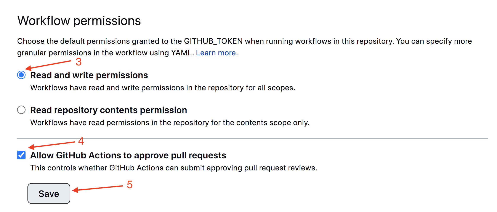

# Пошук зображень

Створено фронтенд частину застосунку пошуку і перегляду зображень за ключовим словом. Додано оформлення елементів інтерфейсу. Демо-відео роботи застосунку ([https://parceljs.org/])(https://drive.google.com/file/d/1H8r6veuLFtayF07QtIyrSq9ia4X10pmM/view?usp=sharing).

## Підготовка нового проекту

1. Переконайся, що на комп'ютері встановлена LTS-версія Node.js.
   [Завантаж та встанови](https://nodejs.org/en/) її, якщо потрібно.
2. Клонуй цей репозиторій.
3. Зміни ім'я папки з `parcel-project-template` на ім'я свого проекту.
4. Створи новий порожній репозиторій на GitHub.
5. Відкрий проект у VSCode, запусти термінал та пов'яжи проект з
   GitHub-репозиторієм
   [за інструкцією](https://docs.github.com/en/get-started/getting-started-with-git/managing-remote-repositories#changing-a-remote-repositorys-url).
6. Встанови залежності проекту в терміналі командою `npm install`.
7. Запусти режим розробки, виконавши команду `npm start`.
8. Перейди у браузері за адресою [http://localhost:1234](http://localhost:1234).
   Ця сторінка автоматично перезавантажуватиметься після збереження змін у
   файлах проекту.

## Файли та теки

- Усі паршали файлів стилів повинні лежати у теці (в папці) `src/sass` та
  імпортуватися у файли стилів сторінок. Наприклад, для `index.html` файл стилів
  називається `index.scss`.
- Додавай зображення у теку `src/images`. Збирач оптимізує їх, але лише при
  деплої продакшн версії проекту. Все це відбувається у хмарі, щоб не
  навантажувати твій комп'ютер, так як на слабких машинах це може зайняти багато
  часу.

## Деплой

Для налаштування деплою проекту потрібно виконати декілька додаткових кроків по
налаштуванню твого репозиторію. Зайди у вкладку `Settings` та у підрозділі
`Actions` обери пункт `General`.


Прокрути сторінку до останнього розділу, у якому переконайся, що обрані опції як
на наступному зображенні, та натисни `Save`. Без цих налаштувань у збірці буде
недостатньо прав для автоматизації процесу деплою.



Продакшн версія проекту буде автоматично збиратися та деплоїтися на GitHub
Pages, у гілку `gh-pages`, кожного разу, коли оновлюється гілка `main`.
Наприклад, після прямого пушу або прийнятого пул-реквесту. Для цього необхідно у
файлі `package.json` відредагувати поле `homepage` та скрипт `build`, замінивши
`your_username` і `your_repo_name` на свої, та відправити зміни на GitHub.

```json
"homepage": "https://your_username.github.io/your_repo_name/",
"scripts": {
  "build": "parcel build src/*.html --public-url /your_repo_name/"
},
```

Далі потрібно зайти у налаштування GitHub-репозиторію (`Settings` > `Pages`) та
встановити роздачу продакшн версії файлів із теки /root гілки gh-pages, якщо це
не було зроблено автоматично.


### Статус деплоя

Статус деплоя останнього коміту відображається іконкою поруч із його
ідентифікатором.

- **Жовтий колір** - виконується збірка та деплой проекту.
- **Зелений колір** - деплой завершився успішно.
- **Червоний колір** - під час лінтингу, збірки або деплою виникла помилка.

Докладнішу інформацію про статус можна переглянути, клікнувши на іконку, та у
випадаючому вікні перейти за посиланням `Details`.


### Жива сторінка

Через деякий час, зазвичай декілька хвилин, живу сторінку можна буде переглянути
за адресою, вказаною у відредагованій властивості `homepage`. Наприклад, ось
посилання на живу версію для цього репозиторію
[https://goitacademy.github.io/parcel-project-template](https://goitacademy.github.io/parcel-project-template).

Якщо відкривається порожня сторінка, переконайся, що у вкладці `Console` немає
помилок, пов'язаних з неправильними шляхами до CSS та JS файлів проекту
(**404**). Ймовірно, у тебе неправильне значення властивості `homepage` або
скрипту `build` у файлі `package.json`.

## Як це працює


1. Після кожного пушу до гілки `main` репозиторію на GitHub, запускається
   спеціальний скрипт (GitHub Action) з файлу `.github/workflows/deploy.yml`.
2. Усі файли репозиторію копіюються на сервер, де проект ініціалізується та
   проходить збірку перед деплоєм.
3. Якщо всі кроки пройшли успішно, зібрана продакшн версія файлів проекту
   відправляється до гілки `gh-pages`. У випадку проблеми, у лозі (в логе)
   виконання скрипту буде зазначено, в чому саме проблема.
