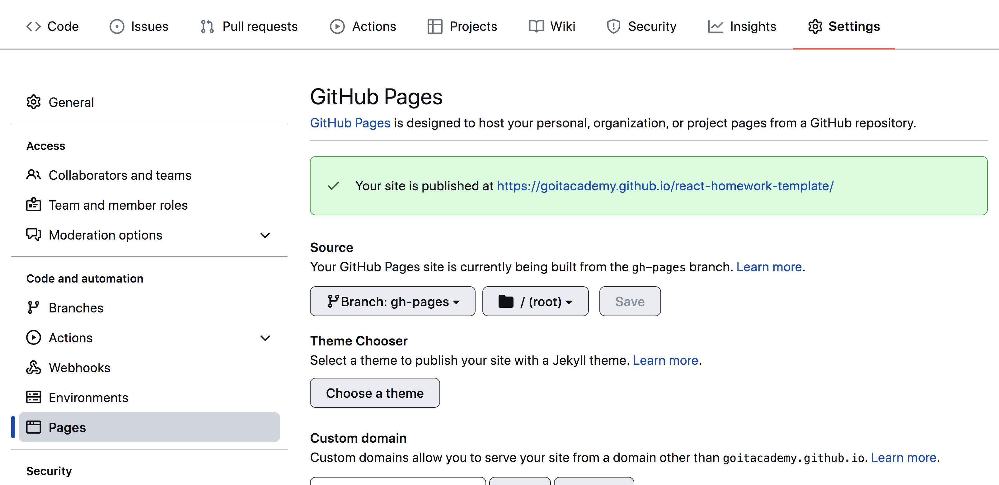

# Пошук зображень

Створено фронтенд частину застосунку пошуку і перегляду зображень за ключовим словом. Додано оформлення елементів інтерфейсу. Демо-відео роботи застосунку [за цим посиланням](https://drive.google.com/file/d/1H8r6veuLFtayF07QtIyrSq9ia4X10pmM/view?usp=sharing).

## Критерії

- Проект зібраний за допомогою [`parcel-project-template`](https://github.com/goitacademy/parcel-project-template)
- Для HTTP-запитів використана бібліотека [`axios`](https://axios-http.com/) [`axios`](https://axios-http.com/)
- Використовується синтаксис `async/await`.
- Для повідомлень використана бібліотека [`notiflix`](https://github.com/notiflix/Notiflix#readme)
- Код відформатований за допомогою `Prettier`.

### Форма пошуку

Форма спочатку міститься в HTML документі. Користувач буде вводити рядок для
пошуку у текстове поле, а по сабміту форми необхідно виконувати HTTP-запит.

```html
<form class="search-form" id="search-form">
  <input
    type="text"
    name="searchQuery"
    autocomplete="off"
    placeholder="Search images..."
  />
  <button type="submit">Search</button>
</form>```


## Деплой


Продакшн версія проекту буде автоматично збиратися та деплоїтися на GitHub
Pages, у гілку `gh-pages`, кожного разу, коли оновлюється гілка `main`.
Наприклад, після прямого пушу або прийнятого пул-реквесту. Для цього необхідно у
файлі `package.json` відредагувати поле `homepage` та скрипт `build`, замінивши
`your_username` і `your_repo_name` на свої, та відправити зміни на GitHub.

```json
"homepage": "https://your_username.github.io/your_repo_name/",
"scripts": {
  "build": "parcel build src/*.html --public-url /your_repo_name/"
},
```

Далі потрібно зайти у налаштування GitHub-репозиторію (`Settings` > `Pages`) та
встановити роздачу продакшн версії файлів із теки /root гілки gh-pages, якщо це
не було зроблено автоматично.



### Статус деплоя

Статус деплоя останнього коміту відображається іконкою поруч із його
ідентифікатором.

- **Жовтий колір** - виконується збірка та деплой проекту.
- **Зелений колір** - деплой завершився успішно.
- **Червоний колір** - під час лінтингу, збірки або деплою виникла помилка.

Докладнішу інформацію про статус можна переглянути, клікнувши на іконку, та у
випадаючому вікні перейти за посиланням `Details`.


### Жива сторінка

Через деякий час, зазвичай декілька хвилин, живу сторінку можна буде переглянути
за адресою, вказаною у відредагованій властивості `homepage`. Наприклад, ось
посилання на живу версію для цього репозиторію
[https://goitacademy.github.io/parcel-project-template](https://goitacademy.github.io/parcel-project-template).

Якщо відкривається порожня сторінка, переконайся, що у вкладці `Console` немає
помилок, пов'язаних з неправильними шляхами до CSS та JS файлів проекту
(**404**). Ймовірно, у тебе неправильне значення властивості `homepage` або
скрипту `build` у файлі `package.json`.

## Як це працює


1. Після кожного пушу до гілки `main` репозиторію на GitHub, запускається
   спеціальний скрипт (GitHub Action) з файлу `.github/workflows/deploy.yml`.
2. Усі файли репозиторію копіюються на сервер, де проект ініціалізується та
   проходить збірку перед деплоєм.
3. Якщо всі кроки пройшли успішно, зібрана продакшн версія файлів проекту
   відправляється до гілки `gh-pages`. У випадку проблеми, у лозі (в логе)
   виконання скрипту буде зазначено, в чому саме проблема.
